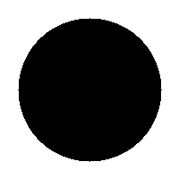
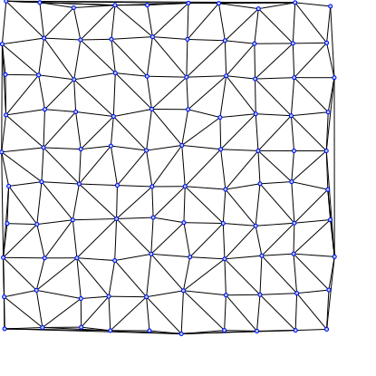

# Protfólio na IV122 (jaro 2019)
## Celkové hodnotenie
Slabé stránky:
* [TODO]

Silné stránky:
* [TODO]

## Týždeň 1 - Rozcvička:
[Zadanie](https://www.fi.muni.cz/~xpelanek/IV122/zadani/zadani-rozcvicka.pdf)
#### A) Hrátky s čísly
`1.` Číslo s najväčším počtom deliteľov som hľadal prejdením všetkých čísel nasledovnou funkciou:
```pythonstub
def divisor_count(n: int) -> int:
    divs = 0
    for i in range(1, int(math.sqrt(n)) + 1):
        if n % i == 0:
            divs += 1
    divs = 2 * divs - (1 if int(math.sqrt(n)) ** 2 == n else 0)
    return divs
```
Číslo s najvyšším deliteľom (menšie než 10000) je 7560 (64 deliteľov).

`2.` 200 čísel menších ako 1000 sa nedá vyjadriť ako súčet 3 štvorcov.

Kód na nájdenie najmenších častí
 ```pythonstub
squares: Dict[int, int] = {i * i: i for i in range(1, int(math.sqrt(top)) + 1) if i * i < top}
prev: Dict[int, AbstractSet[Tuple[int, ...]]] = {key: {(value,)} for key, value in squares.items()}
for count in range(1, k):
    new = defaultdict(set)
    for leftsum, tuples in prev.items():
        for square, base in squares.items():
            if leftsum + square < top:
                for tup in tuples:
                    new[leftsum + square].add(tuple(sorted((base,) + tup)))
    prev = new
prev
``` 
Počet spôsobov, koľkými je možné vytvoriť tieto čísla:


`3.` 6171 sa ukončí po 262 krokoch, čo je najviac zo všetkých čísel do 10000.

Ukážka kódu z triedy, ktorá memoruje celé sekvenie. Tento spôsob je pamäťovo neefektívny, ale umožnuje rýchlo 
```pythonstub
def get(self, n: int) -> int:
    if n in self.mem:
        return self.mem[n]
    nxt = (n // 2) if n % 2 == 0 else (n * 3 + 1)
    self.mem[n] = 1 + self.get(nxt)
    return self.mem[n]
```

`4.` 49061 je hľadaná suma.

Funkcia na zistenie, či je dané číslo prvočíslo.
```pythonstub
def isprime(n: int) -> bool:
    for i in range(1, int(math.sqrt(n))):
        i += 1
        if n % i == 0:
            return False
    return True
```

`5.` 1594323 je prvé číslo väčšie než 1000000 v zadanej postupnosti.

Ukážka pamäťovo neefektívneho kódu ktorý hľadá dané číslo.
```pythonstub
seq = [1, 1]
while seq[-1] <= limit:                # limit = 1'000'000
    a, b = seq[-1], seq[-2]
    seq.append(a + b + math.gcd(a, b))
return seq[-1]
```


### B) Práce s grafikou

Rasterový obrázok zo zadania generuje nasleduvný skript:
```pythonstub
image_array = np.dstack((np.fromfunction(lambda x, y: 256 * y / imgdim, shape=imgsize, dtype=np.uint32),  # R
                         np.zeros(shape=imgsize, dtype=np.uint32),                                        # G
                         np.fromfunction(lambda x, y: 256 * x / imgdim, shape=imgsize, dtype=np.uint32))) # B
```

Výsledný obraz vyzerá takto:


Hviezdu som generoval z "rohov", ktoré ju tvoria.

```pythonstub
def corner(self, drawing: svgwrite.drawing.Drawing, size: int = 100, steps=10, pos=(0, 0), direction=(1, 1)):
    # transform moves a point according to the `pos` and `direction` parameters 
    transform = lambda x: add_tuple(pos, mult_tuple(direction, x))
    for i in range(steps + 1):
        p = size / steps * i
        drawing.add(svgwrite.shapes.Line(transform((p, 0)), transform((size, p)), stroke='black'))
```
Výsledok:


### C) Ulamova spirála


Algoritmus pre efektívne generovanie Ulamovej špirály pomocou iterovania kým napravo od aktuálneho smeru je nejaká hodnota.  
```pythonstub
array = np.zeros((2 * size + 1, 2 * size + 1), dtype=np.uint32)
array[size][size] = 1
pos = (size, size + 1)
direction = Direction.UP
value = 2
for i in range(4 * size):
    while array[add_tuple(direction.turn_right().value, pos)] != 0:
        array[pos] = value
        value += 1
        pos = add_tuple(pos, direction.value)
        if pos[0] == array.shape[0] or pos[1] == array.shape[1]:
            break
    direction = direction.turn_right()
return array
```

Na toto pole o veľkosti `1001x1001` boli následne volané funkcie `int -> bool`, ktoré vytvorili rôzne vzory.

Prvočísla:


Deliteľné 5:


Deliteľné 8:


Fibonačiho postupnosť (táto postupnosť nie je taká zaujímavá, lebo rastie exponenciálne, čiže vyššie hodnoty su príliš "riedke"):


### D) Vizualizace NSD

`1.` Vizualizácia `NSD(x,y) / MAX(x,y)` `x,y <= 1500`:


`2.` Vizualizácia počtu krokov Euklidovho algoritmu:
* Odčítavacia verzia:
```pythonstub
def gcd_sub(a: int, b: int) -> int:
    count = 0
    while True:
        if a < b:
            a, b = b, a
        if a == b:
            return count
        a, b = a - b, b
        count += 1
```


* Modulo verzia:
```pythonstub
def gcd_mod(a: int, b: int) -> int:
    count = 0
    while True:
        if a < b:
            a, b = b, a
        if b == 0:
            return count
        a, b = b, a % b
        count += 1
```

* Obe verzie spolu (Červený kanál je odčítacia a modrý je modulo varianta):


## Týždeň 2 - Kombinatorika, výpočty:

[zadanie](https://www.fi.muni.cz/~xpelanek/IV122/zadani/zadani-cisla.pdf)

### A) Generování kombinací, permutací, variací

### B) Pascalův trojúhelník

Pascalov trojuholník som vygeneroval pomocou objektu, ktorý memoruje hodnoty a 
garantuje alokovanie pamäte pre každé volanie.
```pythonstub
def _get(self, r: int, c: int):
    if self.data[r][c] is None:
        if c == 0 or r == c:
            self.data[r][c] = 1
        else:
            self.data[r][c] = self._get(r - 1, c - 1) + self._get(r - 1, c)
            if self.mod is not None:
                self.data[r][c] = self.data[r][c] % self.mod
    return self.data[r][c]
```


50 riadkov pascalovho trojuholníku so zafarbením `mod 5`.


500 riadkov pascalovho trojuholníku so zafarbením `mod 5`.


500 riadkov pascalovho trojuholníku so zafarbením `mod 10`.

### C) Výpočet π

Pi som vypočítaval pomocou 3 rôznych algoritmov.

Liebnitzov vzorec:
```pythonstub
def leibniz_formula(precision=1e-5):
    pi = 0.
    delta = 999
    k = 0
    while delta > precision:
        delta = (4. if k % 2 == 0 else -4.) / (2 * k + 1)
        pi += delta
        k += 1
    return pi
```

Archimedesova sekvencia:
```pythonstub
def archimedes_sequence(precision=1e-5):
    n = 2
    dn = math.sqrt(2)
    delta = 999
    while delta > precision:
        d2n = math.sqrt(2 - 2 * math.sqrt(1 - dn ** 2 / 4))
        if d2n < 0.0000001:
            break
        delta = abs(d2n * 2 * n - dn * n)
        dn = d2n
        n *= 2
    return dn * n
```

Monte Carlo v štvrťskruhu:  
```pythonstub
def monte_carlo(precision=1e-5):
    shots = 0
    hits = 0
    delta = 999
    while delta > precision:
        prev = hits / shots * 4 if shots else 0
        for _ in range(1000):
            x, y = random.random(), random.random()
            if x * x + y * y < 1:
                hits += 1
            shots += 1
        delta = abs(prev - hits / shots * 4)
    return hits / shots * 4
```

Efektivitu týchto algoritmov som meral ako počet spustení za jednotku času (čas je v ns).

### D) Umocňování

Implementoval som 2 algoritmy:

```pythonstub
def pow(base: float, power: int, modulo: int):
    ongoing = 1
    exp = base % modulo
    while power != 0:
        if power % 2 == 1:
            ongoing = (ongoing * exp) % modulo
        power = power // 2
        exp = (exp * exp) % modulo
    return ongoing
```
Efektívny algoritmus na výpočet celočíselných mocnín.

```pythonstub
def pow_naive(base: float, power: int, modulo: int):
    tmp = 1
    for _ in range(power):
        tmp = (tmp * base) % modulo
    return tmp
```
Naivný algoritmus na výpočet celočíselných mocnín.

Tieto algoritmy som následne porovnal na 3 rôznych výpočtoch:

| Vzorec                                           | Čas efektívneho | Čas neefektívneho |  
|--------------------------------------------------|-----------------|-------------------|
| `123^1234567 (mod 1000000007)`                   | 7700 ns         | 140718000 ns      |   
| `9^10 (mod 2)`                                   | 3100 ns         | 3700 ns           |   
| `123456^12345678901234567890 (mod 1000000007)`   | 19000 ns        | N/A               |   

Následne som zmeral rýchlosť efektívnej implementácie v závislosti od rastúceho exponentu (10 vzorkov pre každý bod):


Ako môžeme vidieť, zložitosť algoritmu naozaj rastie logaritmicky s rastúcim exponentom.

## Týždeň 3 - Geometrie, želví grafika
[zadanie](https://www.fi.muni.cz/~xpelanek/IV122/zadani/zadani-geometrie-zelva.pdf)

### A) Knihovna pro želví grafiku

Chovanie korytnačky som sprístupnil cez triedu `src.common.Turtle.Turtle`, 
ktorá má všetky požadované funkcie, kde pre zjednodušenie používania má 
`forward` aj `back` voliteľný parameter na použitie pera.
Na implementáciu vykreslovania bola použitá knižnica `svgwrite`.

Pre zjednodušenie používania som pridal aj metódy `line` pre vykreslenie čiary
podľa absolútne zadaných súradníc a `resetpos`, ktorá presunie korytnačku
na danú pozíciu (užitočné na vykreslenie viac obrazcov do 1 súboru).


### B) Vykreslování relativně vs. absolutně

Ako najvhodnejšie spôsoby vykreslovania som zvolil korytnačku vo všetkých obrazcoch
s výnimkou obrazca C (mriežka), v ktorom som zvolil absolútne súradnice.


### C) Želví grafika a fraktály

Pomocou korytnačej grafiky som vygeneroval skoro všetky fraktály až na Krishna Anklet.


### D) Kreativita želvy

Keď som si pozeral rôzne možné fraktály, narazil som na L-systémy, ktoré ma veľmi zaujali.
Jedná sa o reprezentácie sebepodobných fraktálov pomocou gramatiky, kde jednotlivé symboly
sú po konečnom počte substitúcíi nahradené akciami (otočenie alebo pohyb). Tento systém 
taktiež obsahuje zásobník, na ktorý je možné uložiť pozíciu. Ten som implementoval iba
pomocou zoznamu, ktorý si ukladá pozície, ale dalo by sa to vyriešiť aj pridaním inverzných
funkcíi ku existujúcim pohybom, ktoré by sa ukladali na zásobník a pri odobraní zo zásobníka by sa 
spustili, aby sa korytnačka vždy vrátila na pôvodnú pozíciu. Týmto by sa simulovala 
rekurzia v normálnom jazyku.

Príklady vykreslených obrazcov a kódy, ktoré ich vygenerovali:

```pythonstub
init = 'F+F+F'
rules = {'F': 'F-F+F'}        
```


```pythonstub
init = 'F'
rules = {'F': 'FF-[XY]+[XY]',
         'X': '+FY',
         'Y': '-F'}
```


```pythonstub
init = 'F+XF+F+XF'
rules = {'F': 'F',
         'X': 'XF-F+F-XF+F+XF-F+F-X'}
```


```pythonstub
init = 'F'
rules = {'F': 'FfF', 'f': 'fff'}
```


```pythonstub
init = 'F+F+F+F'
rules = {'F': 'FF+F++F+F'}
```


## Týždeň 4 - Geometrie, bitmapová grafika
[zadanie](https://www.fi.muni.cz/~xpelanek/IV122/zadani/zadani-bitmap.pdf)

### A) Základní útvary

Tieto tvary sú jednoduché netreba ku nim bližší popis.




### B) Mnohoúhelník

Mnohouholník som vykreslil tak, že som najskôr nakreslil jeho obrys a potom som ho vyplnil.
Na vyplnenie som pomocou vektorového súčinu zistil, ktorý smer je vnútry mnohouholníku
a tým smerom som sa posúval, kým som nenašiel prázdny pixel. 


### C) Efekty

Tieto efekty som generoval pomocou pomocnej funkcie, ktorá umožňuje aplikovanie 
funkcie na pixely zvolené podľa masky. Ako funkciu som volil negatív pixelu.
Tretí obrázok je obrázok, kde `R = sin(x)`, `G = sin(x+y)` a `B = sin(y)` (následne
som tieto hodnoty normalizoval na rozsah hodnôt pixelu). 


### D) Bonus: Skrývačky

Prvá skrývačka obsahuje text v modrom kanáli. Tak z neho vyberieme túto informáciu
a zapíšeme ju do našeho výsledného obrázku.
```pythonstub
image.putpixel((x, y), 1 if source.getpixel((x, y))[2] != 0 else 0)
```


Druhá skrývačka obsahuje text na ostrých prechodoch od susedných pixelov. Tento prechod
nájdeme nasledujúcim kódom.
```pythonstub
this = np.array(source.getpixel((x, y)))
delta = 0
for dx in (1, 0):
    for dy in (1, 0):
        if x + dx in range(image.width) and y + dy in range(image.height):
            delta += np.sum(np.abs(np.array(source.getpixel((x + dx, y + dy))) - this))
image.putpixel((x, y), 1 if delta < maxdelta else 0)
```  


Tretia skrývačka obsahuje text za XORom mriežky a je ku tomu textu pridaný šum.
V tejto ukážke má `source` bitovú hĺbku 1. 
```pythonstub
image.putpixel((x, y), ((x+y)%2) ^ source.getpixel((x,y)))
``` 


## Týždeň 5 - Geometrické algoritmy
[zadanie](https://www.fi.muni.cz/~xpelanek/IV122/zadani/zadani-geom-alg.pdf)

### A) Průsečníky úseček

Najskôr som potreboval vygenerovať úsečky, na ktorých by som počítal priesečníky. Tie som vygeneroval ako náhodné body, 
z ktorých pod náhodným uhlom vychádzala úsečka fixnej dĺžky.

Následne som hľadal priesečník v `O(n^2)` nájdením priesečníka medzi každými dvomi úsečkami. Priesečník som hľadal 
nasledovnou funkciou:
```python
def intersect_linesegments(segment1, segment2):
    (x1, y1), (x2, y2) = segment1
    (x3, y3), (x4, y4) = segment2
    xden = (x1 - x2) * (y3 - y4) - (y1 - y2) * (x3 - x4)
    yden = (x1 - x2) * (y3 - y4) - (y1 - y2) * (x3 - x4)
    if xden == 0 or yden == 0:  # colinear
        if x1 < x3 < x2:
            return x3
        if x1 < x4 < x2:
            return x4
        if y1 < y3 < y2:
            return y3
        if y1 < y4 < y2:
            return y4
        return None
    x = ((x1 * y2 - y1 * x2) * (x3 - x4) - (x1 - x2) * (x3 * y4 - y3 * x4)) / xden
    y = ((x1 * y2 - y1 * x2) * (y3 - y4) - (y1 - y2) * (x3 * y4 - y3 * x4)) / yden
    if min(x1, x2) <= x <= max(x1, x2) and min(x3, x4) <= x <= max(x3, x4) \
            and min(y1, y2) <= y <= max(y1, y2) and min(y3, y4) <= y <= max(y3, y4):
        return x, y
    return None
``` 

`if xden == 0 or yden == 0:` slúži na detekciu rovnobežných priamok. V tom prípade,
ak je nejaký prekryv, tak volím nejaký bod, ktorý patrí. Inak sa riadim vzorcom z prezentácie
a nakoniec overujem, či daný bod leží v obdĺžniku, ktorému priamka leží na uhlopriečke. 

Príklad nájdenia pretínajúcich sa vrcholov:


### B) Triangulace

Implementoval som greedy aj Delaunayov algoritmus na trianguláciu.

Greedy si najskôr predpočíta vzdialenosti medzi každou dvojicou bodov a potom postupuje od najkratšej po najdlhšiu hranu
a ak sa nepretína so žiadnou z už pridaných, tak ju pridáme do triangulácie. Keďže v planárnom grafe platí `E ~ V` tak 
zložitosť tohoto riešenia je `O(n^3)`.


Delaunayov algoritmus je o čosi komplikovanejši, keďže využíva greedy na vytvorenie iniciálnej konfigurácie, ktorú sa snaží
vylepšiť. Po vypočítaní hrany úvodnej triangulácie prechádza cez všetky vrcholy `A` a snaží sa nájsť susediace vrcholy `B` a `C`, ktoré 
spolu s ním tvoria trojuholník (tieto trojuholníky nemôžu mať žiadny vrchol vnútri). Potom prejde všetky vrcholy `D`, ktoré 
tvoria trojuholník `BCD` a ak `D` leží v kružnici opísanej `ABC`, tak odstráni hranu `BC` a nahradí ju hranou `AD`. Táto
implementácia je veľmi neefektívna a veľa výpočtov v nej by sa dalo optimalizovať, alebo vypočítať mimo cyklu. Z dôvodu 
jednoduchosti a čitateľnosti kódu som ho nezlepšoval.

Body s normálnym rozdelením (Greedy a Delaunay):


Body na mriežke (Greedy a Delaunay):




Body na mriežke s odstánenými vrcholmi (Greedy a Delaunay):


### C) Konvexní obal

Na výpočet konvexného obalu som implementoval Jarvisov a Grahamov algoritmus.

Jarvisov algoritmus najskôr nájde najľavejší vrchol a potom z neho sa pozrie na všetky vrcholy a hľadá ten, ktorý je 
najviac napravo oproti predchádzajúcej hrane. Na začiatok ako predchádzajúcu hranu používam bod naľavo od iniciálneho 
bodu.

Grahamov algoritmus taktiež najskôr nájde najľavejší vrchol, ale potom si spočíta, aké sú uholy medzi vektorom doľava a 
vektorom od najľavejšieho vrcholu ku každému vrcholu. Tieto uhly následne usporiadame a postupne vrcholy pridávame do 
obalu a ak vytvoria konkávny tvar, tak predchádzajúci vložený vrchol odstraňujeme, dokým nebude výsledný tvar kovexný.

```python
hull = [leftmost, points_by_angle[0]]
for point in points_by_angle[1:]:
    hull.append(point)
    while len(hull) != 3 and get_direction(hull[-3] - hull[-2], hull[-1] - hull[-2]) == 'R':
        hull[-2] = hull[-1]
        del hull[-1]
```

Ukážky konvexných obalov:

 


## Týždeň 6 - Fraktály, chaos
[zadanie](https://www.fi.muni.cz/~xpelanek/IV122/zadani/zadani-fraktaly-chaos.pdf)

### A) Chaos game

TODO

### B) Feigenbaumov diagram

TODO

### C) L-systémy

TODO

## Týždeň 7 - Fraktály, komplexné čísla
[zadanie](https://www.fi.muni.cz/~xpelanek/IV122/zadani/zadani-fraktaly-complex.pdf)

TODO

## Týždeň 8 - Transformácie v rovine
[zadanie](https://www.fi.muni.cz/~xpelanek/IV122/zadani/zadani-lingebra.pdf)

### A) Afinní transformace

TODO

### B) Multiple Reduction Copy Machine (MRCM)

TODO

## Týždeň 9 - Pravdepodobnosť
[zadanie](https://www.fi.muni.cz/~xpelanek/IV122/zadani/zadani-pravdepodobnost.pdf)

### A) Monty Hall Problem

Pre tento problém som vykonal simulácie pre 3 rôzne stratégie (1'000'000 vzoriek pre každú):
* Vždy mení;
* Vždy ostáva;
* Rozhoduje sa náhodne.

Podľa znalosti tejto hry by mali byť očakávané pravdepodobnosti výhry
pri zmene 67%, pri ponechaní voľby 33% a pri náhodnom výbere 50% ().

Výsledok simulácie:


### B) Nenáhodná čísla

* `random1.txt` -- Pravdepodobnosť 2 krát po sebe toho istého čísla je znížená
* `random2.txt` -- Počet výskytov čísla 2 je znížený a počeť 5 je zvýšený
* `random3.txt` -- Táto postupnosť vyzerá náhodne, ale pri pohľade na 4-grami má trochu širšie rozloženie než `random7.txt`.
* `random4.txt` -- Nerovnomerné rozloženie bigramov - 
* `random5.txt` -- Postupnosť `1 6 2 5 3 4` má 112 výskytov, čo je omnoho viac než je očakávané.
* `random6.txt` -- Iba niektoré trigramy sa vyskytujú v tejto sekvencíi
* `random7.txt` -- Táto postupnosť vyzerá náhodne.


### C) Centrální limitní věta

__K<sub>a</sub>__ - preferuje vyššie čísla

__K<sub>b</sub>__ - preferuje nižšie čísla

1. Ak každý hod vykonávame kockou K<sub>a</sub>, tak je očakávaný výsledok by 
mal zodpovedať normálnej distrubúcii pravdepodobnosti s posunutým stredom.
1. Ak náhodne zvolíme ktorú kocku použijeme, tak pravdepodobnosť výberu bude 
zodpovedať súčtu normálnej distribúcie pre K<sub>a</sub> a K<sub>b</sub>.
1. Ak náhodne vykonáne všetkých _n_ hodov s 1 kockou, tak výsledok bude rovnaký, 
ako pri variante 2.

Simulácie boli vykonané na vzorkách o veľkosti 100'000.


### D) Bayesova věta a simulace

Vykonal som 100'000 simulácii pre každú hodnotu a výsledky
sú v nasledujúcich grafoch:


Ako je možné vidieť a bolo ľahko očakávateľné, pravdepodobnosť
falošnej kocky klesá značne rýchlo s rastúcim počtom kociek, 
ale iba pre malé počty hodov. V závislosti od počtu hodov klesá 
táto pravdepodobnosť exponenciálne. 