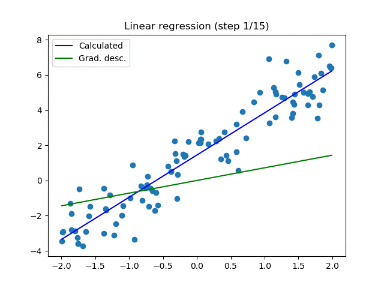
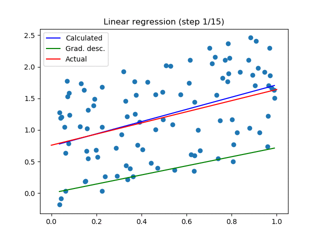
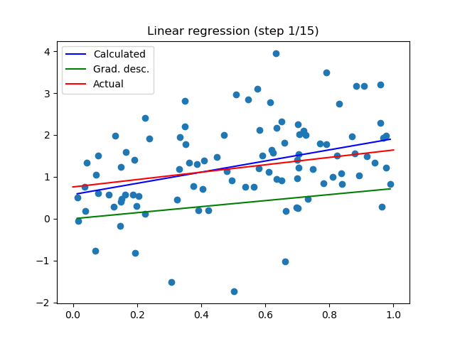

## Týždeň 11 - Analýza dat
[zadanie](https://www.fi.muni.cz/~xpelanek/IV122/zadani/zadani-analyza-dat.pdf)

**Ak zhluky nie sú animované, treba kliknúť na ne. Využívajú SVG animácie, ktoré sa nemusia všade chovať ideálne.**

### A) Lineární regrese

Lineárnu regresiu som implementoval analytickým riešením a cez gradient descent.
Analytické riešenie je jednoduché:

```python
def analytical_solution(x, y):
    assert len(x) == len(y)
    n = len(x)
    a = (n * sum(x_i * y_i for x_i, y_i in zip(x, y)) - sum(x) * sum(y)) / (
            n * sum(x_i ** 2 for x_i in x) - sum(x) ** 2)
    b = sum(y) / n - a * sum(x) / n
    return a, b
```

Na druhú stranu, gradient descent je komplikovanejší v tom, že treba správne identifikovať learning rate, inak je veľmi ťažké dosiahnuť dobré výsledky,
Moja implementácia je ale aj tak veľmi jednoduchá:

```python
def gradient_descent(x, y, iters, init=None, lr=0.1):
    if init is None:
        a, b = random.uniform(0, 1), 0
    else:
        a, b = init
    for _ in range(iters):
        grad_a = 2 / len(x) * (-sum(xi * (yi - (a * xi + b)) for xi, yi in zip(x, y)))
        grad_b = 2 / len(x) * (-sum(yi - (a * xi + b) for xi, yi in zip(x, y)))
        a -= lr * grad_a
        b -= lr * grad_b
    return a, b
```

Voľba iniciálnych hodnôt síce nie je úplne optimálna, pretože je obmedzená na malú podmnožinu možných priamok, ale aj tak konverguje ku správnemu výsledku.
Ako ďalší krok na vylepšenie tejto implementácie by som navrhoval lepšiu voľbu parametrov iniciálnej priamky a implementáciu hybnosti.

[Linreg](../resources/w11/linreg.txt) dataset:



Generovaný dataset s rovnomerným rozložením:



Generovaný dataset s Gaussovou distribúciou chyby:




Pri všetkých týchto datasetoch môžeme vidieť, že úvodná voľba priamky je veľmi zlá a spomaľuje nájdenie správnej priamky.
Na druhú stranu implementovanie hybnosti (momentum) by zrýchlilo nájdenie aspoň čiastočne správneho výsledku.

### B) Detekce shluků

Na detekciu zhlukov som implementoval k-means algoritmus, ktorý identifikuje _stredy_ jednotlivých clusterov a tie aktualizuje preddefinovaný počet iterácii.

```python
def kmeans(points, init_idxs=None, n=None, iterations=10):
    assert init_idxs is None or n == len(init_idxs)
    random.seed(433308)
    if init_idxs is None:
        init = random.sample(points, n)
    else:
        init = [points[i] for i in init_idxs]

    selected = init
    clusters = [[] for _ in selected]

    for _ in range(iterations):
        clusters = [[] for _ in selected]
        for point in points:
            clusters[closest(point, selected)].append(point)
        selected = [sum(cluster) / len(cluster) if len(cluster) != 0 else selected[idx] for idx, cluster in
                    enumerate(clusters)]
    return clusters, selected
```

_Pri niektorých ukážkach boli iniciálne hodnoty nastavené ručne aby lepšie ilustrovali priebeh výpočtu._

[Faithful](../resources/w11/faithful.txt) dataset (2):


Oddelené clustery (3):


Veľmi blízke clustery (3):


Ako je možné vidieť, tak aj na veľmi tesných datasetoch sa tento algoritmus správa veľmi dobre, ak je správne zvolený počet clusterov.
Clustery sú správne identifikované aj ak sú počiatočné hodnoty zvolené nevhodne.