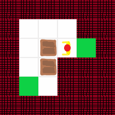
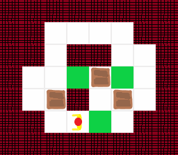
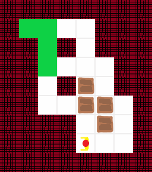

## Týždeň 12 - Grafy a bludiště
[zadanie](https://www.fi.muni.cz/~xpelanek/IV122/zadani/zadani-bludiste-reseni.pdf)

## A) Číselné bludiště

Táto úloha je vcelku jednoduchá, pretože nevyžaduje, žiadne pokročilé algoritmy a prevod do grafu je priamočiary.
Stačí z každého bodu vytvoriť hrany do 4 smerov, kam sa vieme pohnúť.

```python
def maze_to_graph(maze: List[List[int]]) -> nx.DiGraph:
    g = nx.DiGraph()
    n = len(maze)
    for y in range(n):
        for x in range(n):
            candidates = [maze[y][x] * np.array(i) + (x, y) for i in [(-1, 0), (1, 0), (0, 1), (0, -1)]]
            for c in candidates:
                if np.all(c >= 0) and np.all(c < n):
                    g.add_edge((x, y), tuple(c.tolist()))
    return g
```

Výstupom je iba jednoduchá séria súradníc, po ktorých sa treba presúvať.

```text
Maze 0: (0, 0) -> (2, 0) -> (2, 2) -> (2, 3) -> (3, 3) (unique)
Maze 1: (0, 0) -> (0, 3) -> (3, 3) -> (1, 3) -> (1, 4) -> (2, 4) -> (4, 4) (unique)
Maze 2: (0, 0) -> (0, 1) -> (1, 1) -> (1, 4) -> (0, 4) -> (3, 4) -> (4, 4)
Maze 3: (0, 0) -> (9, 0) -> (1, 0) -> (8, 0) -> (8, 8) -> (6, 8) -> (6, 9) -> (4, 9) -> (7, 9) -> (9, 9)
```

## B) Variace na bludiště dle vlastní volby

Ako bludišťový variant som zvolil Sokoban, pretože mám problém prejsť aj jednoduchšie levely v tejto hre.
Ako metriku najrýchlejšieho riešenia som zvolil minimalizovať počet krokov.
Obmedzenie vstupného formátu je že nie je možné mať v počiatočnom stave cieľový blok, na ktorom je krabica alebo človek. 

Celý problém som previedol na graf možných stavov a následne som v ňom hľadal najkratšiu cestu. 
Vďaka tomuto by bolo možné algoritmus jednoducho zmeniť aby priradil hranám rôzne váhy (napríklad ak presúvame krabicu, tak má hrana vyššiu váhu).

```python
def solve_sokoban(fn):
    with open(fn) as fd:
        plane = load_map(fd)

    g, idx_to_cell, cell_to_idx = generate_graph(plane)

    start = get_start_state(plane, cell_to_idx)
    ends = list(get_end_states(plane, cell_to_idx))

    shortest = inf,
    for end in ends:
        p = nx.shortest_path(g, start, end)
        shortest = min(shortest, (len(p), p))

    return coords_to_moves([idx_to_cell[x] for x, _ in shortest[1]])
```

Výstupom programu sú animácie riešenia. Počiatočné stavy boli prevzaté z [www.umimematiku.cz](https://www.umimematiku.cz).

Jednoduché zadanie:



Ťažké zadanie:



Zadanie zo slajdov:

