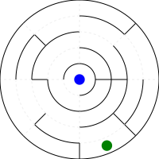
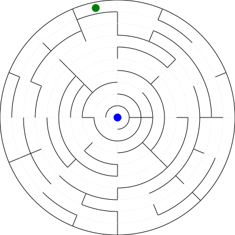
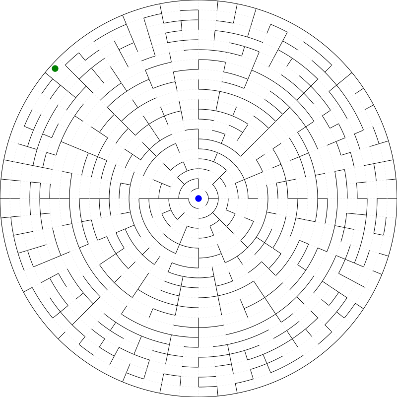

## Týždeň 12 - Generování bludišť
[zadanie](https://www.fi.muni.cz/~xpelanek/IV122/zadani/zadani-generovani-bludist.pdf)

## A) Perfektní bludište kruhové

Rozhodol som sa vytvoriť kruhové bludište.
Kontrolovateľné paramtere sú veľkosť (priemer) a hustota (počet segmentov v prvej vrstve).
Čím ďalej ideme od stredu, tým na viacej políčok treba rozdeliť danú vrstvu.
Keďže každé políčko vždy rozdelujeme na 2, tak počet políčok na vrstve by rástol exponenciálne.
Preto musíme zdvojnásobovať len medzi správnymi vrstvami.
Keď je celý graf vytvorený, tak už len ostáva náhodne ohodnotiť hrany a vypočítať MST.
Následne ohodnotenie všetkých hrán zmením na 1 aby som mohol vypočítať vzdialenosť všetkých bodov na najvonkajšej kružnici.
Aby výsledok vyzeral zaujímavejšie, tak začiatok vždy vyberám z 20% najvzdialenejších políčok.
Výstupom je SVG súbor. 

