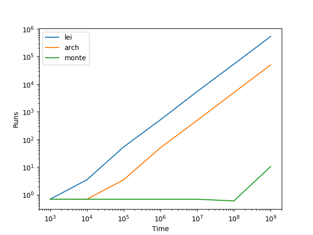

## Týždeň 2 - Kombinatorika, výpočty:

[zadanie](https://www.fi.muni.cz/~xpelanek/IV122/zadani/zadani-cisla.pdf)

### A) Generování kombinací, permutací, variací

### B) Pascalův trojúhelník

Pascalov trojuholník som vygeneroval pomocou objektu, ktorý memoruje hodnoty a 
garantuje alokovanie pamäte pre každé volanie.
```pythonstub
def _get(self, r: int, c: int):
    if self.data[r][c] is None:
        if c == 0 or r == c:
            self.data[r][c] = 1
        else:
            self.data[r][c] = self._get(r - 1, c - 1) + self._get(r - 1, c)
            if self.mod is not None:
                self.data[r][c] = self.data[r][c] % self.mod
    return self.data[r][c]
```


50 riadkov pascalovho trojuholníku so zafarbením `mod 5`.


500 riadkov pascalovho trojuholníku so zafarbením `mod 5`.


500 riadkov pascalovho trojuholníku so zafarbením `mod 10`.

### C) Výpočet π

Pi som vypočítaval pomocou 3 rôznych algoritmov.

Liebnitzov vzorec:
```pythonstub
def leibniz_formula(precision=1e-5):
    pi = 0.
    delta = 999
    k = 0
    while delta > precision:
        delta = (4. if k % 2 == 0 else -4.) / (2 * k + 1)
        pi += delta
        k += 1
    return pi
```

Archimedesova sekvencia:
```pythonstub
def archimedes_sequence(precision=1e-5):
    n = 2
    dn = math.sqrt(2)
    delta = 999
    while delta > precision:
        d2n = math.sqrt(2 - 2 * math.sqrt(1 - dn ** 2 / 4))
        if d2n < 0.0000001:
            break
        delta = abs(d2n * 2 * n - dn * n)
        dn = d2n
        n *= 2
    return dn * n
```

Monte Carlo v štvrťskruhu:  
```pythonstub
def monte_carlo(precision=1e-5):
    shots = 0
    hits = 0
    delta = 999
    while delta > precision:
        prev = hits / shots * 4 if shots else 0
        for _ in range(1000):
            x, y = random.random(), random.random()
            if x * x + y * y < 1:
                hits += 1
            shots += 1
        delta = abs(prev - hits / shots * 4)
    return hits / shots * 4
```

Efektivitu týchto algoritmov som meral ako počet spustení za jednotku času (čas je v ns).

### D) Umocňování

Implementoval som 2 algoritmy:

```pythonstub
def pow(base: float, power: int, modulo: int):
    ongoing = 1
    exp = base % modulo
    while power != 0:
        if power % 2 == 1:
            ongoing = (ongoing * exp) % modulo
        power = power // 2
        exp = (exp * exp) % modulo
    return ongoing
```
Efektívny algoritmus na výpočet celočíselných mocnín.

```pythonstub
def pow_naive(base: float, power: int, modulo: int):
    tmp = 1
    for _ in range(power):
        tmp = (tmp * base) % modulo
    return tmp
```
Naivný algoritmus na výpočet celočíselných mocnín.

Tieto algoritmy som následne porovnal na 3 rôznych výpočtoch:

| Vzorec                                           | Čas efektívneho | Čas neefektívneho |  
|--------------------------------------------------|-----------------|-------------------|
| `123^1234567 (mod 1000000007)`                   | 7700 ns         | 140718000 ns      |   
| `9^10 (mod 2)`                                   | 3100 ns         | 3700 ns           |   
| `123456^12345678901234567890 (mod 1000000007)`   | 19000 ns        | N/A               |   

Následne som zmeral rýchlosť efektívnej implementácie v závislosti od rastúceho exponentu (10 vzorkov pre každý bod):


Ako môžeme vidieť, zložitosť algoritmu naozaj rastie logaritmicky s rastúcim exponentom.