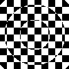
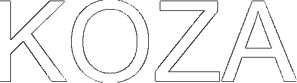
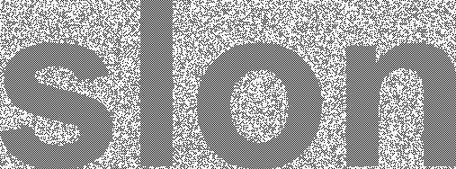

## Týždeň 4 - Geometrie, bitmapová grafika
[zadanie](https://www.fi.muni.cz/~xpelanek/IV122/zadani/zadani-bitmap.pdf)

### A) Základní útvary

Tieto tvary sú jednoduché netreba ku nim bližší popis.


### B) Mnohoúhelník

Mnohouholník som vykreslil tak, že som najskôr nakreslil jeho obrys a potom som ho vyplnil.
Chcel som vyskúšať trochu menej často používaný spôsob vyplnenia stredu než bežný line scan.
Preto som na vyplnenie pomocou vektorového súčinu zistil, ktorý smer je vnútry mnohouholníku
a tým smerom som sa posúval, kým som nenašiel prázdny pixel. 


### C) Efekty

Tieto efekty som generoval pomocou pomocnej funkcie, ktorá umožňuje aplikovanie 
funkcie na pixely zvolené podľa masky. Ako funkciu som volil negatív pixelu.
Tretí obrázok je obrázok, kde `R = sin(x)`, `G = sin(x+y)` a `B = sin(y)` (následne
som tieto hodnoty normalizoval na rozsah hodnôt pixelu). 




### D) Bonus: Skrývačky

Prvá skrývačka obsahuje text v modrom kanáli. Tak z neho vyberieme túto informáciu
a zapíšeme ju do našeho výsledného obrázku.
```pythonstub
image.putpixel((x, y), 1 if source.getpixel((x, y))[2] != 0 else 0)
```


Druhá skrývačka obsahuje text na ostrých prechodoch od susedných pixelov. Tento prechod
nájdeme nasledujúcim kódom.
```pythonstub
this = np.array(source.getpixel((x, y)))
delta = 0
for dx in (1, 0):
    for dy in (1, 0):
        if x + dx in range(image.width) and y + dy in range(image.height):
            delta += np.sum(np.abs(np.array(source.getpixel((x + dx, y + dy))) - this))
image.putpixel((x, y), 1 if delta < maxdelta else 0)
```  


Tretia skrývačka obsahuje text za XORom mriežky a je ku tomu textu pridaný šum.
V tejto ukážke má `source` bitovú hĺbku 1. 
```pythonstub
image.putpixel((x, y), ((x+y)%2) ^ source.getpixel((x,y)))
``` 



### E) Vlastná skrývačka

Ako vlastnú skrývačku som skryl dáta do najnižšieho bitu červeného kanálu.

Fotka so skrytou správou:


Vyextrahovaná správa:

