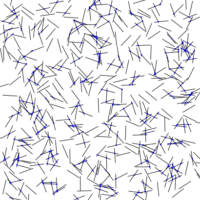
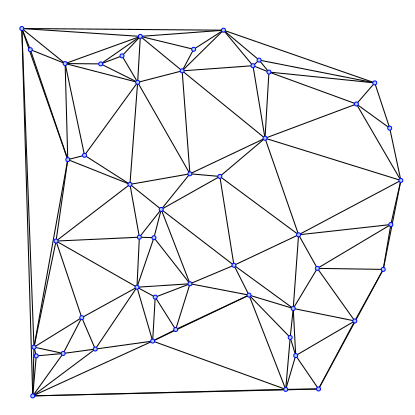
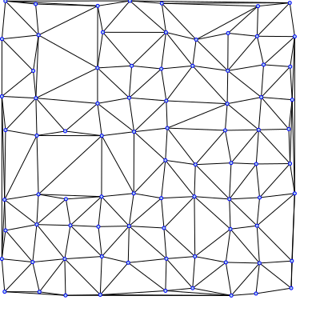
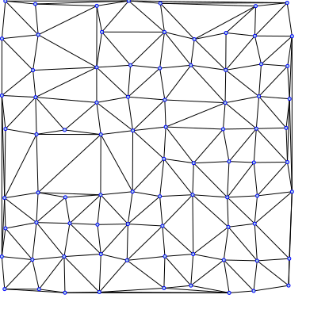
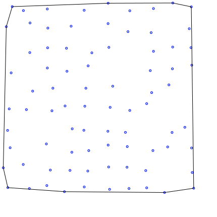

## Týždeň 5 - Geometrické algoritmy
[zadanie](https://www.fi.muni.cz/~xpelanek/IV122/zadani/zadani-geom-alg.pdf)

### A) Průsečníky úseček

Najskôr som potreboval vygenerovať úsečky, na ktorých by som počítal priesečníky. Tie som vygeneroval ako náhodné body, 
z ktorých pod náhodným uhlom vychádzala úsečka fixnej dĺžky.

Následne som hľadal priesečník v `O(n^2)` nájdením priesečníka medzi každými dvomi úsečkami. Priesečník som hľadal 
nasledovnou funkciou:
```python
def intersect_linesegments(segment1, segment2):
    (x1, y1), (x2, y2) = segment1
    (x3, y3), (x4, y4) = segment2
    xden = (x1 - x2) * (y3 - y4) - (y1 - y2) * (x3 - x4)
    yden = (x1 - x2) * (y3 - y4) - (y1 - y2) * (x3 - x4)
    if xden == 0 or yden == 0:  # colinear
        if x1 < x3 < x2:
            return x3
        if x1 < x4 < x2:
            return x4
        if y1 < y3 < y2:
            return y3
        if y1 < y4 < y2:
            return y4
        return None
    x = ((x1 * y2 - y1 * x2) * (x3 - x4) - (x1 - x2) * (x3 * y4 - y3 * x4)) / xden
    y = ((x1 * y2 - y1 * x2) * (y3 - y4) - (y1 - y2) * (x3 * y4 - y3 * x4)) / yden
    if min(x1, x2) <= x <= max(x1, x2) and min(x3, x4) <= x <= max(x3, x4) \
            and min(y1, y2) <= y <= max(y1, y2) and min(y3, y4) <= y <= max(y3, y4):
        return x, y
    return None
``` 

`if xden == 0 or yden == 0:` slúži na detekciu rovnobežných priamok. V tom prípade,
ak je nejaký prekryv, tak volím nejaký bod, ktorý patrí. Inak sa riadim vzorcom z prezentácie
a nakoniec overujem, či daný bod leží v obdĺžniku, ktorému priamka leží na uhlopriečke. 

Príklad nájdenia pretínajúcich sa vrcholov:



### B) Triangulace

_Poznámka: Delaunay zatiaľ nefunguje a generuje mnohouholníky_

Implementoval som greedy aj Delaunayov algoritmus na trianguláciu.

Greedy si najskôr predpočíta vzdialenosti medzi každou dvojicou bodov a potom postupuje od najkratšej po najdlhšiu hranu
a ak sa nepretína so žiadnou z už pridaných, tak ju pridáme do triangulácie. Keďže v planárnom grafe platí `E ~ V` tak 
zložitosť tohoto riešenia je `O(n^3)`.


Delaunayov algoritmus je o čosi komplikovanejši, keďže využíva greedy na vytvorenie iniciálnej konfigurácie, ktorú sa snaží
vylepšiť. Po vypočítaní hrany úvodnej triangulácie prechádza cez všetky vrcholy `A` a snaží sa nájsť susediace vrcholy `B` a `C`, ktoré 
spolu s ním tvoria trojuholník (tieto trojuholníky nemôžu mať žiadny vrchol vnútri). Potom prejde všetky vrcholy `D`, ktoré 
tvoria trojuholník `BCD` a ak `D` leží v kružnici opísanej `ABC`, tak odstráni hranu `BC` a nahradí ju hranou `AD`. Táto
implementácia je veľmi neefektívna a veľa výpočtov v nej by sa dalo optimalizovať, alebo vypočítať mimo cyklu. Z dôvodu 
jednoduchosti a čitateľnosti kódu som ho nezlepšoval.
Nanešťastie, mám v kóde bug, ktorý spôsobuje, že Delaunay môže vytvoriť polygóny s viac hranami.
Nepodarilo sa mi zistiť prečo sa to deje a tak sa to stáva súčasťou slabín mojeho portfólia.

Body s normálnym rozdelením (Greedy a Delaunay):




Body na mriežke (Greedy a Delaunay):


Body na mriežke s odstánenými vrcholmi (Greedy a Delaunay):





### C) Konvexní obal

Na výpočet konvexného obalu som implementoval Jarvisov a Grahamov algoritmus.

Jarvisov algoritmus najskôr nájde najľavejší vrchol a potom z neho sa pozrie na všetky vrcholy a hľadá ten, ktorý je 
najviac napravo oproti predchádzajúcej hrane. Na začiatok ako predchádzajúcu hranu používam bod naľavo od iniciálneho 
bodu.

Grahamov algoritmus taktiež najskôr nájde najľavejší vrchol, ale potom si spočíta, aké sú uholy medzi vektorom doľava a 
vektorom od najľavejšieho vrcholu ku každému vrcholu. Tieto uhly následne usporiadame a postupne vrcholy pridávame do 
obalu a ak vytvoria konkávny tvar, tak predchádzajúci vložený vrchol odstraňujeme, dokým nebude výsledný tvar kovexný.

```python
hull = [leftmost, points_by_angle[0]]
for point in points_by_angle[1:]:
    hull.append(point)
    while len(hull) != 3 and get_direction(hull[-3] - hull[-2], hull[-1] - hull[-2]) == 'R':
        hull[-2] = hull[-1]
        del hull[-1]
```

Ukážky konvexných obalov:



