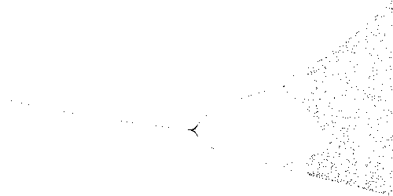

## Týždeň 6 - Fraktály, chaos
[zadanie](https://www.fi.muni.cz/~xpelanek/IV122/zadani/zadani-fraktaly-chaos.pdf)

### A) Chaos game

Nasledujúca ukážka kódu je funkcia, ktorá bola použitá na generovanie
GIF obrázkov simulujúcich Chaos game.

```python
def chaos_game(n, step, k, r, seed=None, size=400):
    random.seed(seed)
    imgs = [Image.new(mode="L", size=(size, size), color=255)]
    points = [np.array([size / 2, size / 2]) + _rotate((0, -size / 2 * 0.9), i * 360 / n) for i in range(n)]
    x = np.array([size / 2, size / 2])
    for _ in range(k):
        img = imgs[-1].copy()
        imgs.append(img)
        for _ in range(step):
            x = x * (1-r) + random.choice(points) * r
            img.putpixel((int(x[0]), int(x[1])), 0)
    return imgs
```


### B) Feigenbaumov diagram

Tento diagram som vytvoril pomocou nasledovnej funkcie.
```python
def bifurcations(rRange, rCount, xRange, xCount, x0):
    img = Image.new("1", (rCount, xCount), 1)
    for ridx in range(rCount):
        r = (rRange[1] - rRange[0]) * ridx / rCount + rRange[0]
        for x in logisticMap(x0, r):
            xidx = int((x - xRange[0]) / (xRange[1] - xRange[0]) * xCount)
            img.putpixel((ridx, xidx), 0)
    return img
```

[Obrázok v plnej veľkosti (10'000 x 5'000)](../results/w6_B__bif_1.png) Náhľad:



### C) L-systémy

L-systémy som riešil v 2 krokoch: generovanie reťazca a vykreslovanie podľa neho.
Generovanie reťazcov je v ukážke nižšie. Následné vykreslovanie podporuje 
aj definovanie funkcie hrúbky čiary, aby mohli byť dosiahnuté zaujímavé efekty.

```python
def generate_string(self, depth):
    s = self.axiom
    for _ in range(depth):
        next_s = []
        for i in s:
            next_s += self.rules[i] if i in self.rules else i
        s = next_s
    return s
```

Strom:


Koch:


Sierpinsky:


Sierpinsky so zmeneným uhlom:


Pentaplexity:


Papraď:


