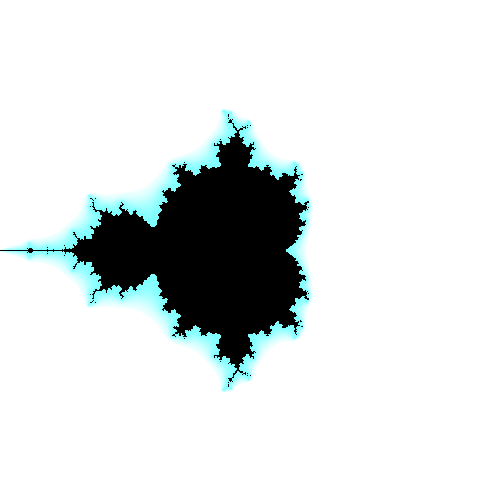
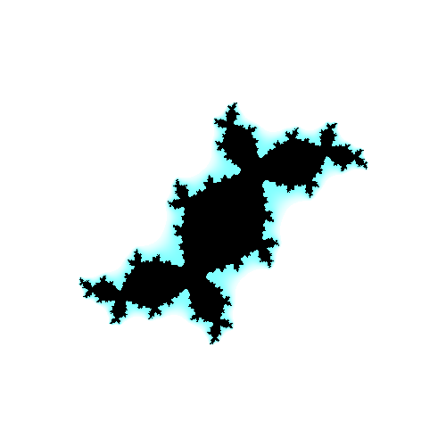
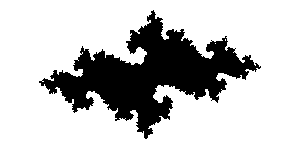
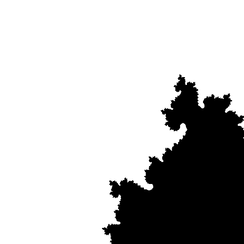

## Týždeň 7 - Fraktály, komplexné čísla
[zadanie](https://www.fi.muni.cz/~xpelanek/IV122/zadani/zadani-fraktaly-complex.pdf)

Implementoval som Mandelbrotovu, Julianovu a Newtonovu množinu v Pythone.
Tieto implementácie sú ale málo efektívne, a potrebujú cca 10s na spracovanie obrázku o rozmeroch 500x500 pixelov a počtom iterácii 20.

Preto som sa rozhodol implementovať výpočet mandelbrotovej množiny v CUDA aby daný výpočet prebiehal na grafickej karte.
Tým som dosiahol omnoho lepšie výsledky, kde obrázok o rozmeroch  24576x16384 (400 MP) bol vygenerovaný za rádovo 10 sekúnd.
Tento obrázok mal pritom vykonaných 1000 iterácii. 
Ako je možné vidieť, tak tento problém sa dá skvele paralelizovať. 
Nevýhodou mojej implementácie je že výstup je v binárnom formáte o 1 bitovej hĺbke.
Tento výstup musí byť následne prekonvertovaný na PNG pomocou `convert`.

[Veľká Mandelbrotova množina](../results/w7_C__mandelbrot_large_1.png.png) 

Mandelbrotova množina:

Juliusova množina:

Newtonova množina:

Newtonova priblížená:

