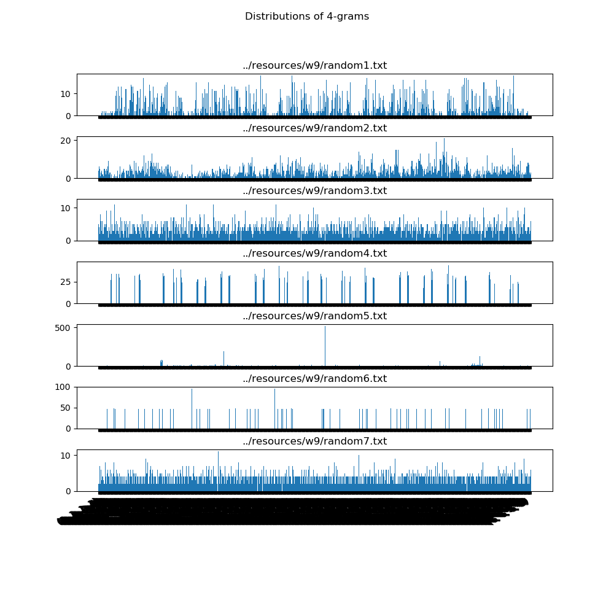
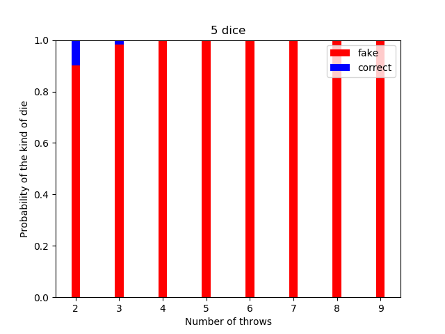
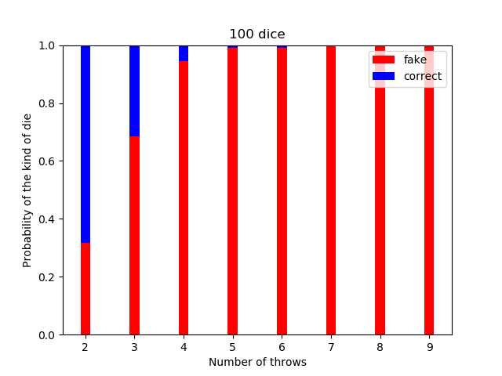

## Týždeň 9 - Pravdepodobnosť
[zadanie](https://www.fi.muni.cz/~xpelanek/IV122/zadani/zadani-pravdepodobnost.pdf)

### A) Monty Hall Problem

Pre tento problém som vykonal simulácie pre 3 rôzne stratégie (1'000'000 vzoriek pre každú):
* Vždy mení;
* Vždy ostáva;
* Rozhoduje sa náhodne.

Podľa znalosti tejto hry by mali byť očakávané pravdepodobnosti výhry
pri zmene 67%, pri ponechaní voľby 33% a pri náhodnom výbere 50% ().

Výsledok simulácie:

### B) Nenáhodná čísla

* `random1.txt` -- Pravdepodobnosť 2 krát po sebe toho istého čísla je znížená
* `random2.txt` -- Počet výskytov čísla 2 je znížený a počeť 5 je zvýšený
* `random3.txt` -- Táto postupnosť vyzerá náhodne, ale pri pohľade na 4-grami má trochu širšie rozloženie než `random7.txt`.
* `random4.txt` -- Nerovnomerné rozloženie bigramov - 
* `random5.txt` -- Postupnosť `1 6 2 5 3 4` má 112 výskytov, čo je omnoho viac než je očakávané.
* `random6.txt` -- Iba niektoré trigramy sa vyskytujú v tejto sekvencíi
* `random7.txt` -- Táto postupnosť vyzerá náhodne.

### C) Centrální limitní věta

__Ka__ - preferuje vyššie čísla

__Kb__ - preferuje nižšie čísla

1. Ak každý hod vykonávame kockou Ka, tak je očakávaný výsledok by 
mal zodpovedať normálnej distrubúcii pravdepodobnosti s posunutým stredom.
1. Ak náhodne zvolíme ktorú kocku použijeme, tak pravdepodobnosť výberu bude 
zodpovedať súčtu normálnej distribúcie pre Ka a Kb.
1. Ak náhodne vykonáne všetkých _n_ hodov s 1 kockou, tak výsledok bude rovnaký, 
ako pri variante 2.

Simulácie boli vykonané na vzorkách o veľkosti 100'000.

### D) Bayesova věta a simulace

Vykonal som 100'000 simulácii pre každú hodnotu a výsledky
sú v nasledujúcich grafoch:

Ako je možné vidieť a bolo ľahko očakávateľné, pravdepodobnosť
falošnej kocky klesá značne rýchlo s rastúcim počtom kociek, 
ale iba pre malé počty hodov. V závislosti od počtu hodov klesá 
táto pravdepodobnosť exponenciálne. 